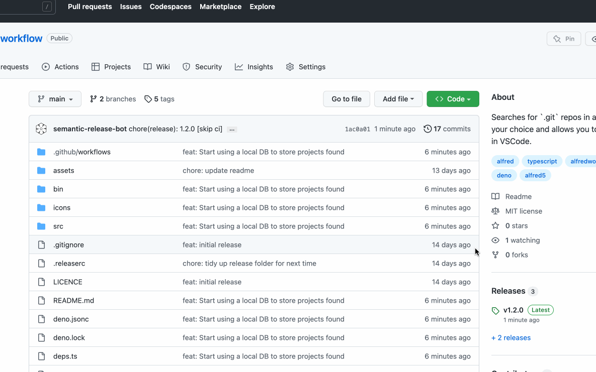

# Open in VSCode workflow


[](https://github.com/semantic-release/semantic-release)
[](https://github.com/whomwah/alfred-vscode-workflow/releases/latest)

alfred-vscode-workflow

Searches for local Git repos based on the path of your choice and allows you to
open them in VSCode. It uses [Deno](https://deno.land/). It's written in
[TypeScript](https://www.typescriptlang.org/).



### Install

The project and workflow requires the [Deno](https://deno.land/) binary to be
installed. This can be done simply from the [Deno](https://deno.land/) website
above.

> [Deno](https://deno.land/) is a runtime for JavaScript.
> [Deno](https://deno.land/) was co-created by Ryan Dahl, who also created
> Node.js.

We also need `findd`:

- [`findd`](https://github.com/whomwah/findd) - A tiny little utility that does
  the magic of finding all the repos really really fast.

The easiest way to install `findd` is via `homebrew` (the same with `deno`):

```
$ brew install deno
$ brew install whomwah/tap/findd
```

Once installed you can
[download the latest version](https://github.com/whomwah/alfred-vscode-workflow/releases/latest)
and double click the `.workflow` file to open and install or update.

## Usage

Initially you will need to choose a folder to scan for projects in the workflow
`config`. Don't choose `~` for example as scanning your home directory may cause
the scanning script to be just too slow to return anything. It's much better to
choose for example `~/my-projects`.

By default you access the workflow via the `vs` command.

There is only one top level command. Other than that you just start typing a
`project` name you are interested in. Once you start seeing results pressing
return will attempt to open that project in VSCode.

```bash
# Settings

vs > ...

# Anything else

vs ...
```

## Development

You will first need to install `deno` as mentioned earlier in this README.

### Tests

`deno task test`

### Formatting

`deno fmt`

### Build your own workflow

You can also build your own version of the workflow with:

```
./bin/build_release <version> <notes>

# example

./bin/build_release 1.2.3 blabla
```

## Resources

- Alfred App:: https://www.alfredapp.com/
- VSCode:: https://code.visualstudio.com/

## Copyright

MIT License (http://www.opensource.org/licenses/mit-license.html)
